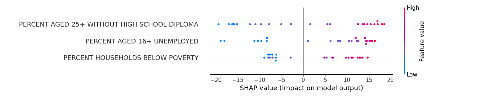
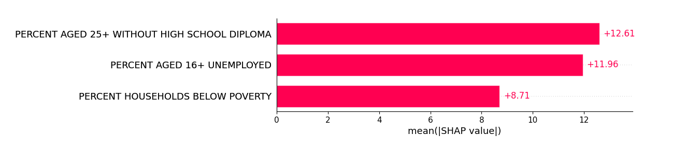

# Unveiling Chicago's Socioeconomic Challenges: A Hardship Index-Based Analysis of Chicago (2008-2012)

## Dependencies

## How to Run
1. Clone the repository.
2. Ensure dependencies are installed (`pip install -r requirements.txt`).
3. Run `python main.py`.

## Abstract
In the United States, enduring challenges of poverty and racial disparities have marked the past three decades, disproportionately impacting Black and Hispanic communities. Notably, their poverty rates stand at 25% and 22%, respectively—twice the rate observed in white communities. Chicago, like numerous other cities, vividly illustrates significant socioeconomic disparities among its various neighborhoods and communities.

To comprehensively grasp the impact of socioeconomic challenges and the adversities faced by these communities, we delved into a census dataset sourced from the city of Chicago for the years 2008 to 2012. Our main goal was to determine the impact of socioeconomic indicators on its hardship index. For this reason, we implemented a Linear Regression, Decision Tree, and Agglomerative Hierarchical Clustering algorithms. The linear regression model outperformed the decision tree regressor model with 96% accuracy. The results pointed to three socioeconomic factors linked to hardship: unemployment, lack of a high school diploma, and living below the poverty line. These factors consistently showed a strong correlation with the hardship index in both linear regression and decision tree regressor models. 

## Feature Selection
In our pursuit of feature selection, we initially employed the linear regression algorithm, using the 'Hardship Index' as the target variable and various socioeconomic variables as independent variables. The dataset was then split into training and testing sets using the train_test_split function, allocating 30% of the data for testing and setting the random state to 42. Following the instantiation and training of the linear regression model, we utilized the R-Squared and Mean Absolute Error (MAE) metrics to assess its performance.

Acknowledging the need for regularization techniques to enhance feature selection, we also introduced Lasso regression into our methodology. Lasso regression incorporates a penalty term based on the absolute values of the coefficients, promoting sparsity and potentially excluding less relevant features. By iteratively fitting the Lasso regression model with different combinations of attributes, we sought to identify a subset of features with optimal predictive power for the 'Hardship Index.'

Our iterative process considered the R-Squared score and MAE to systematically evaluate and select features. The final feature set, determined by both linear regression and Lasso regression, included ‘Percent aged 16+ Unemployed,’ ‘Percent Aged 25+ Without High School Diploma,’ and ‘Percent Households Below Poverty.’ These variables demonstrated consistent high predictive power across both methodologies, reinforcing their significance. Subsequently, we utilized this refined feature set when training the decision tree and random forest regressor models, capitalizing on the potential for enhanced model interpretability and predictive accuracy facilitated by the feature subset identified through the combined use of linear regression and Lasso regression.
## Predictive Modeling Assessment
We assessed the performance of the linear regression, decision tree regressor, and random forest regressor models using the R-Squared metric, Mean Absolute Error (MAE), and Root Mean Square Deviation (RMSE). These metrics were applied to both the actual and predicted results from each model. The linear regression model demonstrated a strong performance with an R-Squared value of 0.96, a Mean Absolute Error of 3.69, and a RMSE of 4.966.   
In contrast, the Decision Tree Regressor yielded an R-Squared value of 0.89, a Mean Absolute Error of 7.04, and a RMSE of 9.187. In comparing these metrics, the higher R-Squared value and lower values for MAE and RMSE in the linear regression model suggested a better overall performance and predictive accuracy compared to the decision tree regressor.  
The Random Forest Regressor exhibited strong predictive performance, aligning closely with the accuracy levels achieved by the linear regression model. With an impressive R-squared value of 0.96, the model effectively captured a substantial portion of the variance in the data, indicating its capability to explain and predict outcomes accurately. The Mean Absolute Error (MAE) of 4.09 and Root Mean Square Error (RMSE) of 5.206 further underscored the model's accuracy, with both metrics showing relatively low values. These results suggest that the Random Forest Regressor excelled in minimizing the difference between predicted and actual values, showcasing its robustness in handling complex relationships within the dataset. 
## Conclusion
In examining census data from Chicago communities from 2008-2012, we uncovered a strong relationship between unemployment, lack of a high school diploma, and living below the poverty line with the hardship index in Chicago communities. The iterative identification of predictive attributes, through linear regression, achieved a high 96% accuracy. 

The results from our cluster analysis showed that the first cluster consisted primarily of a high number of communities that were experiencing unemployment, living below poverty, and had a high hardship index. While the second cluster consisted of communities that experienced less of those challenges. To improve the metrics we would like to work with larger datasets and more specific attributes, this would help us narrow down the issues that impact hardship in communities. It would also be a great opportunity to work with datasets from different cities and compare with the results gathered in this study.

## SHAP Analysis: Interpreting Model Predictions
This section delves into SHAP (SHapley Additive exPlanations) analysis, uncovering how individual features impact our models' predictions. SHAP values serve as a unified measure of feature importance.
 
 
In the figure below, three crucial attributes—Percent aged 25+ without a high school diploma, percent aged 16+ unemployed, and percent of households below the poverty line—are ordered by importance. The x-axis represents SHAP values, with red indicating high values and blue indicating low values. Each point on the graph represents a data row.
 
 
The subsequent SHAP summary reveals a balanced distribution of data points for 'Percent aged 25+ without a high school diploma.' Lower points negatively affect the output, while higher points have a positive impact, enhancing our understanding of feature-value dynamics.

### Visualizations
- Scatter plots for linear regression.
- Decision tree plot.
- Dendrogram for agglomerative clustering.

### Data
- Initial dataset: [Census Data - Chicago 2008-2012]([link_to_dataset.csv](https://data.cityofchicago.org/Health-Human-Services/Census-Data-Selected-socioeconomic-indicators-in-C/kn9c-c2s2)https://data.cityofchicago.org/Health-Human-Services/Census-Data-Selected-socioeconomic-indicators-in-C/kn9c-c2s2)

**Note:** Close generated graphs to see complete results in the terminal.
